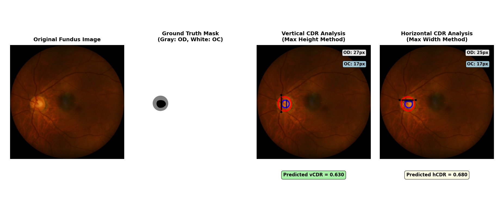
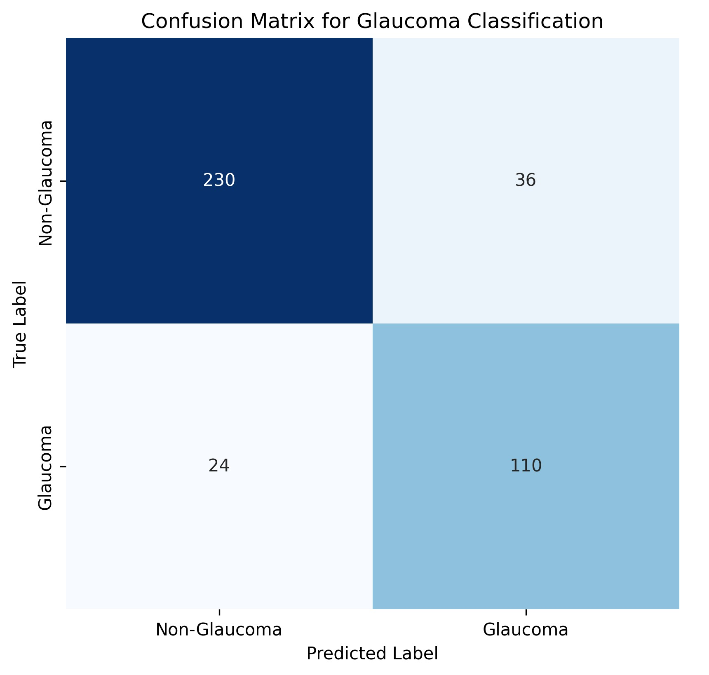

# Glaucoma Cup-to-Disc Ratio Estimation

## 🔍 Overview

An AI-powered solution for automated glaucoma screening through Cup-to-Disc Ratio (CDR) estimation from retinal fundus images. This project leverages deep learning techniques to segment optic disc and optic cup regions, calculate CDR values, and classify images for glaucoma risk assessment.

## 🎯 Problem Statement

Glaucoma is the third leading cause of blindness in Nepal and affects around 1% of the population. Often called the "silent thief of sight," glaucoma causes irreversible vision loss through optic nerve damage. Early detection is crucial, but many patients are already visually impaired at diagnosis due to limited access to advanced diagnostic tools and low public awareness.

## 🧠 Solution Approach

### AI Pipeline
1. **Input**: RGB retinal fundus images
2. **Preprocessing**: Image padding and normalization (quality, illumination, size)
3. **Segmentation**: Fine-tuned U-Net model with frozen encoder blocks
4. **Feature Extraction**: Optic Disc (OD) and Optic Cup (OC) boundary calculation
5. **Output**: Multi-channel segmentation masks, CDR values, and glaucoma classification

### Why CDR?
- Quantifies optic cup enlargement objectively
- CDR changes appear earlier than visual field loss
- Provides consistent metrics for automated screening
- Threshold-based classification (CDR > 0.6) indicates increased glaucoma risk

## 📁 Dataset Structure

```
dataset/
├── train/
│   ├── images/          # Training fundus images (g0001.bmp, g0002.bmp, ...)
│   └── mask/            # Training ground truth masks (g0001.jpg, g0002.jpg, ...)
└── val/
    ├── images/          # Validation fundus images
    └── mask/            # Validation ground truth masks
```

### Dataset Specifications
- **Images**: 400 training + 400 validation RGB fundus images
- **Format**: JPEG/JPG/PNG/BMP with consistent field of view
- **Resolution**: High-quality fundus images (~2124×2056 px)
- **Ground Truth Masks**:
  - 0 = Background (white)
  - 1 = Optic Disc - OD (grey)
  - 2 = Optic Cup - OC (black)

## 📊 Model Performance

### Segmentation Metrics
| Region | IoU | Dice Score |
|--------|-----|------------|
| **Optic Disc** | 0.8002 ± 0.1028 | 0.8845 ± 0.0812 |
| **Optic Cup** | 0.7163 ± 0.1514 | 0.8232 ± 0.1335 |

### CDR Metrics
| Metric | Value |
|--------|-------|
| **vCDR Error** | 0.1336 ± 0.5894 |
| **hCDR Error** | 0.1280 ± 0.6274 |
| **Mean Predicted vCDR** | 0.6200 |
| **Mean Ground Truth vCDR** | 0.5564 |
| **Mean Predicted hCDR** | 0.5842 |
| **Mean Ground Truth hCDR** | 0.5249 |

### Classification Metrics (Threshold: vCDR>0.6, hCDR>0.6)
| Metric | Score |
|--------|-------|
| **Accuracy** | 0.8500 |
| **Sensitivity (Recall)** | 0.8209 |
| **Specificity** | 0.8647 |
| **Precision** | 0.7534 |
| **F1-Score** | 0.7857 |

## 🖼️ Results Visualization

### Sample Results

*Sample segmentation results showing optic disc and cup detection*

### Confusion Matrix

*Classification performance analysis*

## 🚀 Usage

### Installation
```bash
# Clone the repository
git clone https://github.com/ankritRisal/Fundus_images_CDR_segmentation.git

# Install dependencies
pip install -r requirements.txt
```

### Training
```bash
Run FineTuned_Model.ipynb
```

### Evaluation
```bash
python evaluater.py 
```

### Web Interface
```bash
streamlit run newscripts.py
```
Access the frontend demo at `http://localhost:5000`

### Demo

*Demo image of streamlit app*

## 🏗️ Model Architecture

- **Base Model**: U-Net with fine-tuning approach
- **Encoder**: Frozen pre-trained encoder blocks
- **Decoder**: Trainable decoder for segmentation
- **Output Channels**: 3 (Background, Optic Disc, Optic Cup)

## ⚠️ Limitations

The model may not work properly in cases with:
- Poor image quality or low illumination
- Severe optic disc abnormalities
- Images with artifacts or obstructions
- Non-standard fundus camera angles

## 🏥 Clinical Impact

This automated screening tool can:
- Enable early glaucoma detection in resource-limited settings
- Support ophthalmologists with objective CDR measurements
- Reduce screening time and improve patient throughput
- Facilitate remote screening programs in Nepal

## 📈 Future Work

- Expand dataset with more diverse populations
- Implement multi-modal fusion with OCT data
- Develop mobile application for field screening
- Conduct clinical validation studies

## 🤝 Contributing

Contributions are welcome! Please read our contributing guidelines and submit pull requests for any improvements.

## 📄 License

This project is licensed under the MIT License - see the LICENSE file for details.

## 🙏 Acknowledgments

- BPEF-NAAMII Bootcamp and Hackathon 2025
- Glaucoma Society of Nepal

## 📧 Contact

For questions or collaboration opportunities, please contact:
- Ankrit Risal
- Sirjan Acharya

---

*This project aims to contribute to the fight against preventable blindness in Nepal through accessible AI-powered screening technology.*
